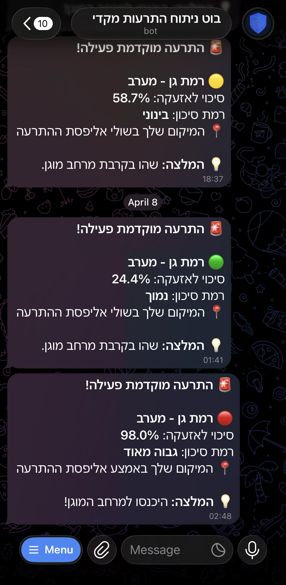
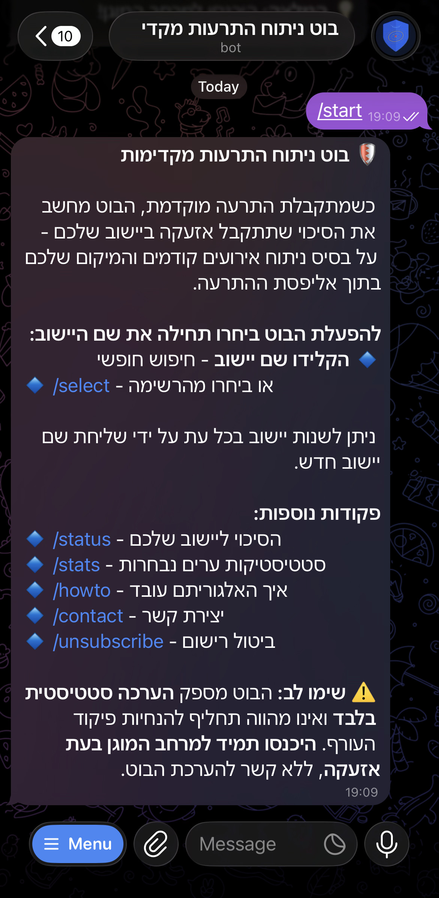
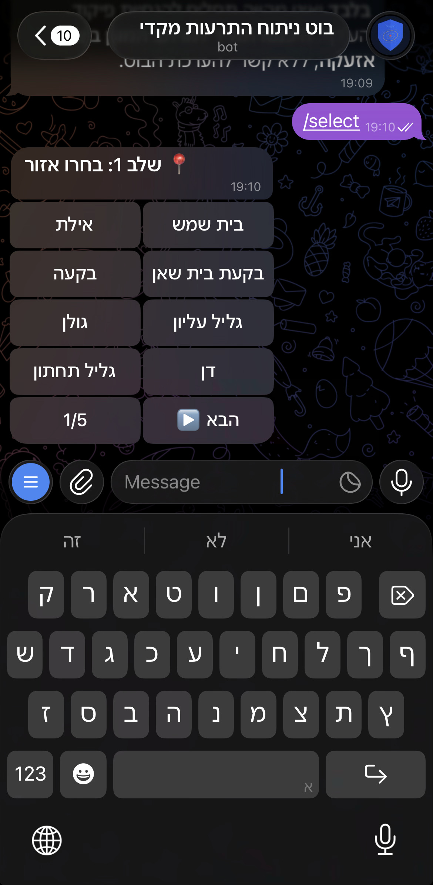
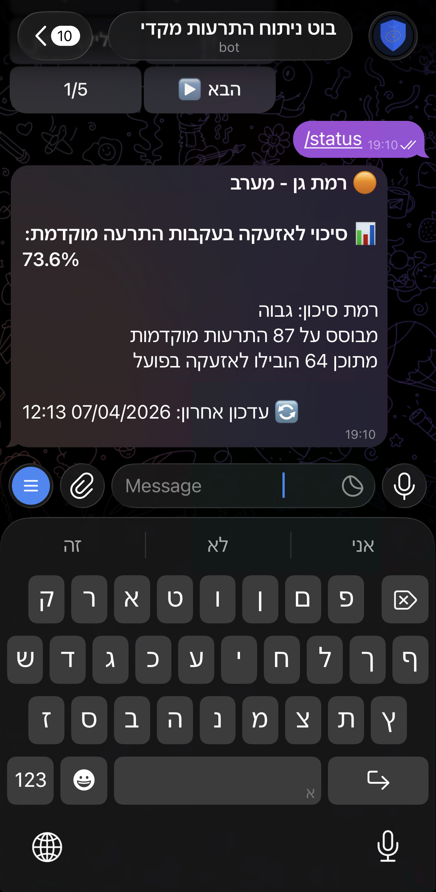

# 🛡️ Oref Predictor Bot

A Telegram bot that predicts the probability of an alarm in your area following an early warning from the IDF Home Front Command.

**[➡️ Open the bot on Telegram](https://t.me/OrefPredictorBot)**

> ⚠️ **Disclaimer:** This bot provides statistical estimates only and is not a substitute for official Home Front Command instructions. **Always enter a protected space when an alarm sounds**, regardless of the bot's prediction.

---

## What Does This Bot Do?

When the Home Front Command issues an **early warning** (התרעה מוקדמת), it covers hundreds of cities - but only some of them will actually receive a **red alert** (אזעקה) minutes later.

This bot analyzes the warning in real time and tells you:
- **The probability** that your specific city will get an actual alarm
- **Your position** within the warning ellipse (center, middle, or edge)
- **A risk level** with a recommendation on what to do

<p align="center">
  
</p>

The probability varies depending on where your city falls within the warning zone - cities at the **center** of the ellipse historically received alarms ~65% of the time, while cities on the **edge** were hit only ~15%.

---

## Getting Started

### 1. Open the Bot

Open [@OrefPredictorBot](https://t.me/OrefPredictorBot) on Telegram and tap **Start**.

<p align="center">
  
</p>

### 2. Choose Your City

You have two ways to register:

- **Type your city name** - the bot will search and register you automatically
- **Use `/select`** - browse by region, then pick your city from the list

<p align="center">
  
</p>

You can change your city at any time by simply sending a new city name.

### 3. Get Your Probability

Use `/status` to see your city's historical alarm probability based on all past early warnings.

<p align="center">
  
</p>

### 4. Receive Live Alerts

When a real early warning is issued, the bot will automatically send you a notification with the predicted probability for your city - no action needed on your part.

---

## Commands

| Command | Description |
|---|---|
| `/start` | Welcome message and instructions |
| `/select` | Choose your city from a region list |
| `/status` | Show your city's alarm probability |
| `/stats` | Compare probabilities across major cities |
| `/howto` | How the prediction algorithm works |
| `/contact` | Send feedback or report issues |
| `/unsubscribe` | Stop receiving notifications |

---

## How the Algorithm Works

1. **Ellipse fitting** - When an early warning arrives, the bot fits a Gaussian ellipse to the coordinates of all warned cities
2. **Mahalanobis distance** - Computes how far your city is from the ellipse center, accounting for the shape and orientation of the warning zone
3. **Random Forest prediction** - A machine learning model combines your distance with 11 other features (city history, polygon size, time of day, etc.) to predict the probability of an alarm

The model is trained on all historical events since March 15, 2026 and refreshes automatically every 6 hours.

---

## Tech Stack

- **Python** - Core language
- **scikit-learn** - Random Forest classifier
- **NumPy** - Ellipse fitting and Mahalanobis distance computation
- **python-telegram-bot** - Telegram Bot API
- **python-socketio** - Real-time WebSocket alerts
- **aiohttp** - Async HTTP client
- **SQLite** - User subscription persistence
- **Oracle Cloud** - Free tier VM hosting

## Data Source

Alert data is sourced from the [RedAlert API](https://redalert.orielhaim.com), which provides real-time and historical data from the IDF Home Front Command.

---

## Project Structure

```
oref-predictor-bot/
├── main.py                      # Entry point
├── src/
│   ├── config.py                # Settings and constants
│   ├── bot.py                   # Telegram bot handlers
│   ├── predictor.py             # ML prediction engine
│   ├── ellipse.py               # Gaussian ellipse fitting
│   ├── city_api.py              # RedAlert cities API client
│   ├── alert_streamer.py        # WebSocket real-time connection
│   ├── subscription_store.py    # SQLite persistence
│   └── data_scraper.py          # Historical data pipeline
└── tools/
    ├── check_city.py            # City statistics tool
    └── debug_city.py            # Event timeline debugger
```

---

## Author

© Yuval Lichtman 2026

📧 yuval.lichtman@gmail.com
